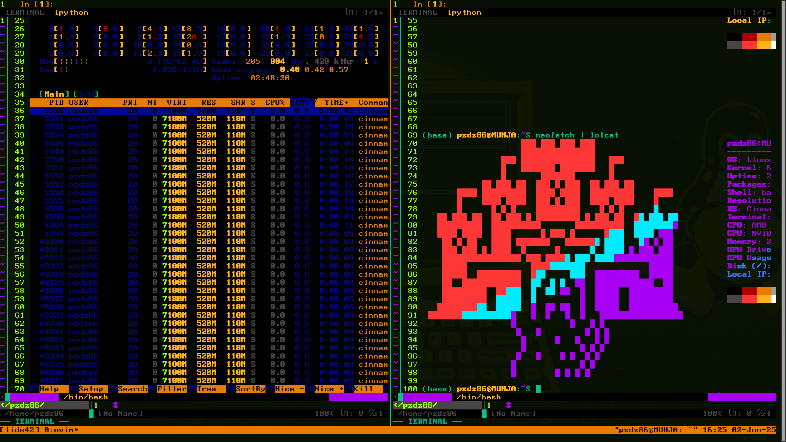
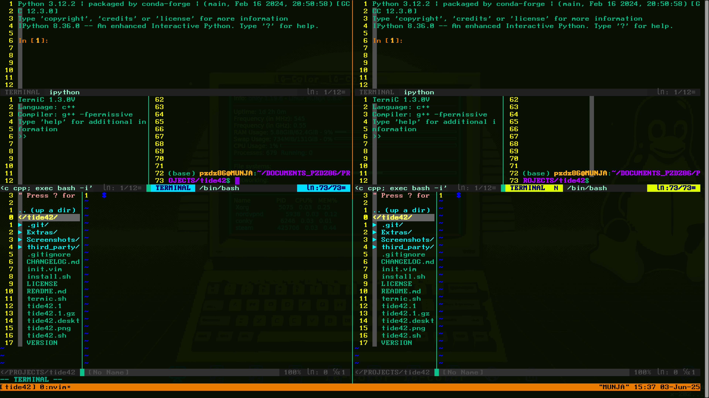
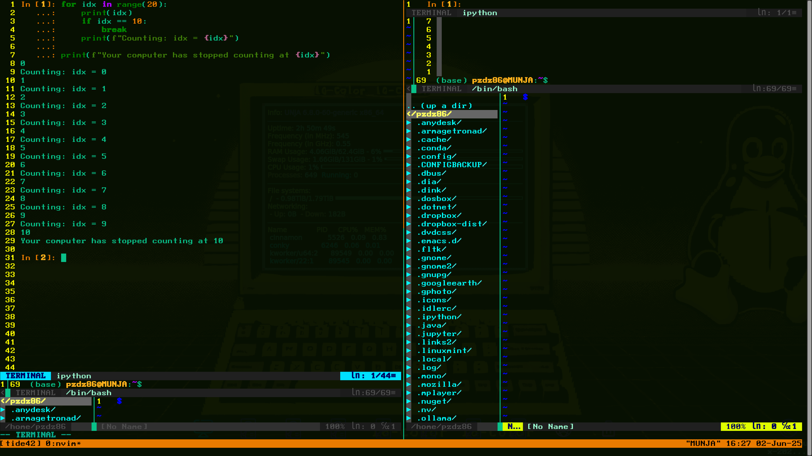
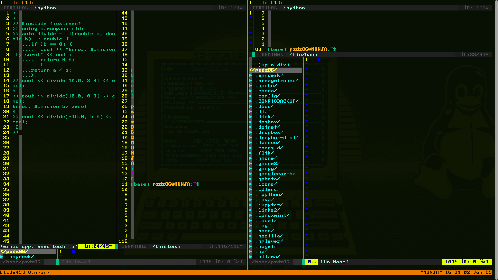
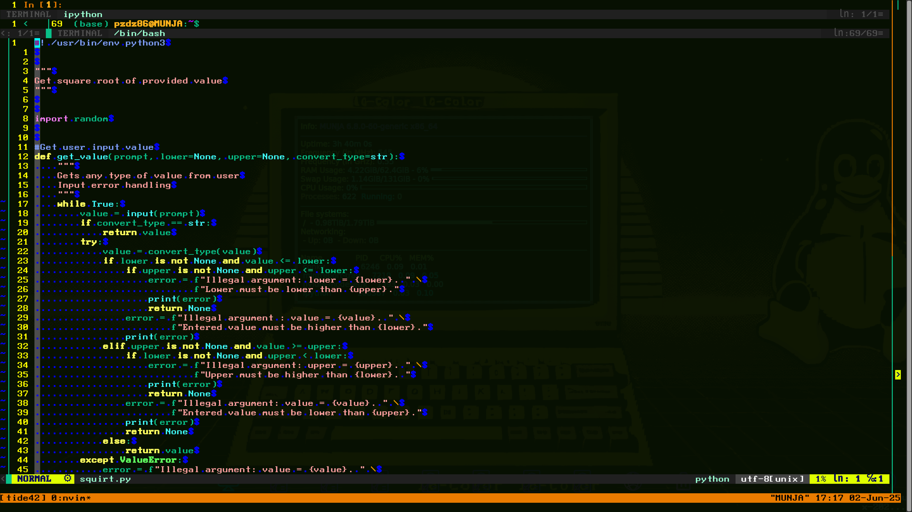
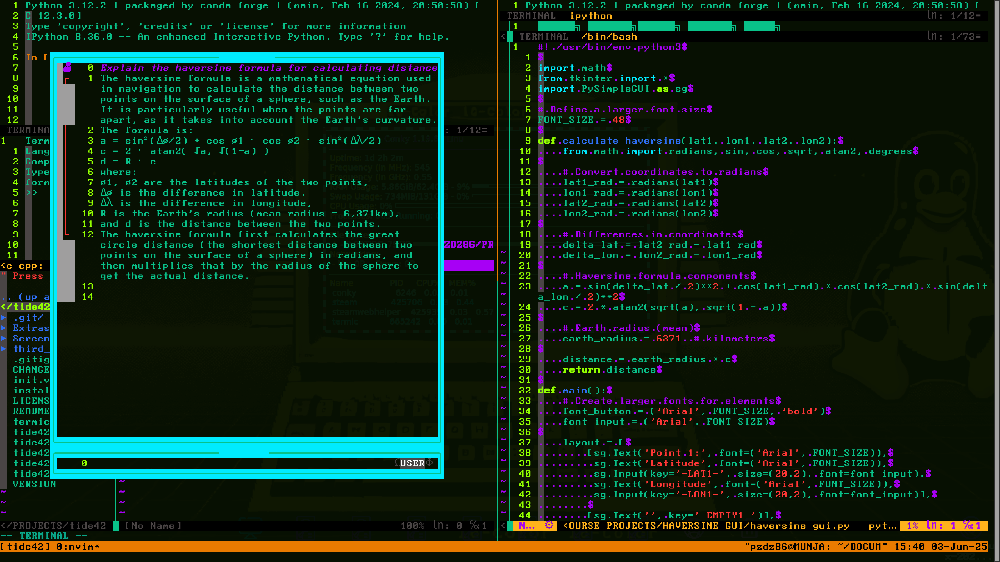

## License

tide42 is licensed under the GNU General Public License v3.0 or later.  
See the [LICENSE](./LICENSE) file for full details.

## TermiC Support

tide42 includes `termic.sh`, a lightweight, interactive C/C++ environment launcher. It will be installed automatically to `/usr/local/bin/termic` unless it already exists.

This script is licensed under GPLv3 and included with permission.

## tide42:
An ultra-efficient Neovim based IDE for Python and C/C++ prototyping.

### Why the name?

Tide42 is inspired in part by *The Hitchhiker’s Guide to the Galaxy*, where "42" is famously revealed as the Answer to the Ultimate Question of Life, the Universe, and Everything. 

This project reflects that same spirit: a terminal IDE that encourages curiosity, simplicity, and discovery—*you ask the questions*. Tide42 is meant to be your solution, leaving the questions in your hands. 

# Terminal IDE 42 NEWS:

05.30.25 tide42 now includes multi system support (Debian, Arch, MacOS) a man page and automated updating from anywhere! (not just the repo directory)

05.29.25 NOTICE FOR EXISTING USERS!! Xtide86 has been renamed tide42 shortly after its release. This reflects a change that is meant to be geared towards you, the user, and your own questions, solutions, and outcomes. All alias logic is handled by install.sh so that --update remains functional. Simply run xtide86 --update from anywhere and use either xtide86 or tide42 to launch.


**Version:** `v1.2.0`
>**New in v1.2.0:** tide42 now fully supports 256-color terminals!
> 
> - Lite mode with --lite to open tide42 with no tmux session for quick edits or low resource systems.
> - Improved color rendering in all panes and status bars
> - Toggle between classic **Portcullis** and modern **GRID** visual themes or medieval listchars in init.vim
> - v1.1.0 Update: Added --color and -c for optional 256 color palette. (Tested on gnome-terminal requries ncurses-term package to be installed). tide42 supports clean minimal setups or full color-rice mode. Your terminal, your choice.
> - Now supports opening new files editing files with tide42 followed by the filename
> - Use flag --quiet or -q to suppress log output.
> - Update tide42 from your anywhere with --update
> - Added keybinding \s to expand and select TermiC or \x to perform the same action for the terminal buffer. 


<pre><code>
                                          ███ ███ ███ ███                      
                                          ███████████████                    
                                      ███ ███████████████   ███                 
                                      █   ███████ ███████   █                
                                      █       ███████       █                 
                                  ██ ███ ██  ███ █ ███  ██ ███ ██             
                             ████ █████████  ████ ████  █████████    ████        
                             █    ████ ████  ███ █ ███  ████ ████    █        
                             █      █ █ █    █████████    █ █ █      █        
                         ██ ███ ██  ██ ███ █ █████████ █ ███ ██  ██ ███ ██   
                         █████████  ██████████       ██████████  █████████   
                         ████ ████  ████      █ ███ █      ████  ████ ████  
                          ██ █ ██   ████ ███████   ███████ ████   ██ █ ██    
                          ███ ███ █ ████  █      █      █  ████ █ ███ ███    
                          ████████████████ ███ █████ ███ ████████████████    
                          █████             ███████████             █████    
                          █████  █████████  ███     ███  █████████  █████    
                          ██  ████████████  ██  █ █  ██  ████████████  ██    
                          █████████  █████  █  ██ ██  █  █████  █████████    
                          █████████  █████  █         █  █████  █████████    
                         ██████████  █████  █  ██ ██  █  █████  ██████████    
                        ██████████████████   █  █   █  █   ████████████████
                                         █           █   █ █
                                          █   █         █ █ █
                                           █      █   █   █ █
                                            █           █ █ █
                                           █   █    █ █  █ █
                                          █             █ █
                                         █        █ █ █ █
</code></pre>


## Coming Soon!
- Functionality to yank text from any buffer (IPython, TermiC, Terminal) and append to file editor for easy notes.
- Opening second file in right tmux buffer if session is detached with a loaded file in the left (default).

## Flags
Enable 88 color support (256 is default) with --low-color or -lcUpdate tide42 (anywhere):--update
Check version: --version
Silence log: --quiet
Help: --help
Install location: --whereami
Lite mode: --lite
Low Color: --low-color, -lc
Update: --update
Force update: --force-update

## Controls

## Keyboard hotkey layout quick reference:

<pre><code>
Ctrl|\
====  =
qw  | wer        iop
asd | sfg         l
|zxcvbn
</code></pre>

Tmux based command: Ctrl-q + d (or gui exit button) = Exit and save tmux state (lost on restart of PC) 
Nvim based command:Q = Force-quit the program (reset for new session)
## Cycle nvim buffers within selected tmux buffer
`Ctrl+ww` = Cycle between vim buffers within a tmux buffer
## Manually select vim buffer within seelcted tmux buffer
`Ctrl+w` + <-, ^, ->, v = Selects vim buffer within current tmux buffer
## Fuzzy Finder
`\w` = fzf selects vim buffer from menu within current tmux buffer (fuzzy finder, vim plugin)
## Telescope
`\e` = Locate file within current directory
## Ripgrep
`\r` = ripgrep within file
## Quick vertical resize within horizontal nvim buffer
`\i` = vertical resize <NUMBER>
## AI
`\o` = optional OpenAI ChatGPT implementation with API key (stored in a global variable)
## Send to IPython
`\p` = Paste selected text into IPython buffer and expand buffer, entering insert mode.
## Send to TermiC
`\l` = Paste selected text into TermiC buffer and expand buffer, entering insert mode

## Tmux buffer controls (work in insert or command mode)
##
`Ctrl+a` = Maximize left tmux buffer
##
`Ctrl+s` = Split tmux buffers
##
`Ctrl+d` = Maximize right tmux buffer
##
`Ctrl+q`  + <-, -> = Switch between tmux buffers (selected buffer matches tmux bar color on the bottom)


## Grid
##
`\f` = Grid (10x10)
##
`\g` = Grid (5x10)

## NeoVim buffer presets
##
`\z` = Maximize edit buffer (lower)
`\s` = Maximize and enter TermiC buffer (left)
##
`\x` = Maximize and enter Terminal buffer(right)
##
`\c` = Maximize IPython buffer (upper)
##
`\v` = Currently selected buffer
##
`\b` = Back to default settings
##
`\n` = Equalize vertical buffer dimensions
##

## Additional NeoVim commands for ease of buffer management
##
`jk` = Command mode from nvim buffer
##
`:Hs` = Quick command for horizontal split

## Tips
##
- ggVG to select all when in nvim command mode followed by  \p or \l for efficient transfer of text into IPython or TermiC
- Once in insert mode in any ``nvim`` buffer, the recommended way of entering command mode is `jk` all other buffers will require `Esc`
- NERTree may be refreshed with Shift+r after performing operations in the terminal buffer.
- All NeoVim commands can also be used in any other buffer. 
- Quickly enter focused and expanded file editor mode with Ctrl A/D (make sure you are in the correct tmux buffer), \z, \i <1000>

## tide42 Remote SSH Session
##
Work remotely. Drop connection. Pick up exactly where you left off.
Instructions:
- ssh user@remotehost
- run tide42 and use any buffer for file transfers or processing.
- Do your work. Close the laptop. Disconnect. Go outside.
- ssh user@remotehost
- run tide42 to reconnect to tmux protected tide42 session.

## Features

- Full ``tmux`` and ``nvim`` '-powered terminal IDE with dynamic buffer management
- Seamless integration with ``IPython``
- ``TermiC`` support with quick pasting and testing C/C++ (smaller blocks recommended or lambda specific functions) see ``Termic`` 
  documentation at https://github.com/hanoglu/TermiC)
- Hotkey support for sending code directly into live interpreter sessions
- Single-interface fallback for simple edits
- Quick launch from Gnome via icon or keyboard shortcut
- Works in the tty as well as the terminal emulator

## Requirements

- ``tmux``
- ``neovim`` 0.9.0+ (tested on 0.9.5)
- ``vim-plug`` curl -fLo ~/.local/share/nvim/site/autoload/plug.vim --create-dirs \
https://raw.githubusercontent.com/junegunn/vim-plug/master/plug.vim 
- ``TermiC`` wget "https://raw.githubusercontent.com/hanoglu/TermiC/main/TermiC.sh"  (live C/C++ shell)
- ``Anaconda3`` with ``IPython`` (preferred, but may work with base ``IPython``)
- ``bash``
- Works on ARM. Tested on a Raspberry Pi5 and nvim 0.9.5 had to be built from source. Check your distro and dependencies on ARM. 


## Warning

If you're running tide42 inside a tmux or custom terminal session, you might run into issues when trying to save root-owned files from within Neovim:
Using commands like :w !sudo tee % in NeoVim may silently fail to prompt for a password and kick you out after 3 attempts.

Solutions:
Use a GUI editor instead within a tide42 terminal buffer to avoid leaving your session:
ex. sudoedit /etc/systemd/system/...
Launch a root nvim in a nested terminal within tide42:
ex. sudo nvim /etc/systemd/system/...


## Installation

# Preferred for updates:
```bash```
- git clone https://github.com/logicmagix/tide42.git
- cd tide42

# Make the script executable (one-time setup)
- chmod +x install.sh
- ./install
- tide42 to start session

# If downloading .zip:
- Go to https://github.com/logicmagix/tide42 and click "Code" > "Download ZIP".
- Extract the ZIP to a directory (e.g., ~/tide42/).
- Run the installation script:
- cd ~/tide42/
- ./install.sh

## Updating tide42

# To update tide42 to the latest version, you must have a cloned Git repository.

- tide42 --update

## Notes:

- The sudo command may prompt for your password to modify /usr/local/bin.
- If you used a ZIP download, you cannot use tide42 --update unless you convert the directory to a Git repository.


## Usage
- Launch tide42 from your terminal or assigned launcher with tide42 or tide42 <FILENAME>. It will:

- Open a tmux session with vertically split nvim, TermiC, and IPython

- Send text from the file editor to the live interpreter buffer with ggVG(select all) \p for ipython and \l for TermiC

- Automatic insert mode and buffer sizing for paste to Termic and paste to IPython functions.

- Support session save (Ctrl+q+d) and reset with :Q

# Without tmux?
- Simply open nvim enjoy all the features without additional buffers and ctrl q + d, ctrl q + a, ctrl q + s, and ctrl q + d controls.

# Customization
- See init.vim for plugin configuration, UI tweaks, and terminal behavior.
Feel free to remix buffer sizes and colors to match your workflow.

# TermiC Support
- tide42 includes termic.sh, a lightweight live shell.
It installs automatically to /usr/local/bin/termic.
Licensed under GPLv3 and included with permission.

Pull requests, stars, and forks welcome 

## Screenshots

- See tide42 in action:

### 	

### tide42 default color scheme


### tide42 now supports 256 colors in tmux


### Full Interface


### Ipython


### C/C++ Live Shell Mode


### System Monitoring in tide42


### Study and reference


### Expanded NVim Focus


### Efficient workflow


### OpenAI Integration shown in default color palette -Optional 


## Built With

tide42 uses and integrates the following open-source tools:
- [NeoVim](https://neovim.io/)
- [Vim](https://www.vim.org/)
- [tmux](https://github.com/tmux/tmux)
- [Anaconda3](https://www.anaconda.com/)
- [IPython](https://ipython.org/)
- [vim-plug](https://github.com/junegunn/vim-plug)
- [NERDTree](https://github.com/preservim/nerdtree)
- [TermiC](https://github.com/your-source-if-public-or-forked)

Thanks to the developers of these projects for making powerful tools free and accessible.

## Acknowledgments

-Made for the engineers who taught us, built by the ones they inspired.
- Thanks to my dad, whose passion for logic and engineering inspired this project.

