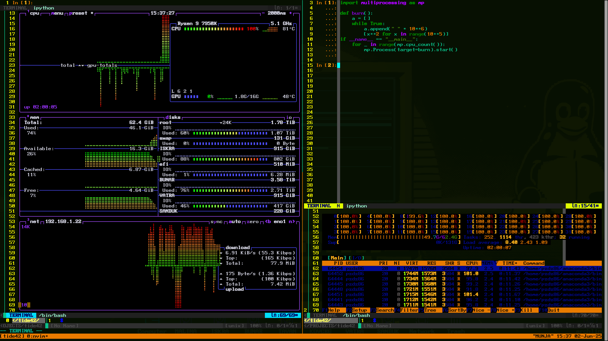

## License

xtide86 is licensed under the GNU General Public License v3.0 or later.  
See the [LICENSE](./LICENSE) file for full details.

## TermiC Support

xtide86 includes `termic.sh`, a lightweight live shell launcher. It will be installed automatically to `/usr/local/bin/termic` unless it already exists.

This script is licensed under GPLv3 and included with permission.

# XTIDE86: XTra IDE 86 

An ultra-efficient Neovim based IDE for Python and C/C++ prototyping.  

## Controls

## Keyboard hotkey layout quick reference:

Ctrl|\
====  =
qw  | wer        iop
asd | fg         l
|zxcvbn

Tmux based command: Ctrl-q + d (or gui exit button) = Exit and save tmux state (lost on restart of PC) 
Nvim based command:Q = Force-quit the program (reset for new session)
## Cycle nvim buffers within selected tmux buffer
`Ctrl+ww` = Cycle between vim buffers within a tmux pane
## Manually select vim buffer within seelcted tmux buffer
`Ctrl+w` + <-, ^, ->, v = Selects vim buffer within current tmux panel
## Fuzzy Finder
`\w` = fzf selects vim buffer from menu within current tmux panel (fuzzy finder, vim plugin)
## Telescope
`\e` = Locate file within current directory
## Ripgrep
`\r` = ripgrep within file
## Quick vertical resize within horizontal nvim buffer
`\i` = vertical resize <NUMBER>
## AI
`\o` = optional OpenAI ChatGPT implementation with API key (stored in a global variable)
## Send to IPython
`\p` = Paste selected text into IPython panel and expand buffer, entering insert mode.
## Send to TermiC
`\l` = Paste selected text into TermiC panel and expand buffer, entering insert mode

## Tmux pane controls (work in insert or command mode)
##
`Ctrl+a` = Maximize left tmux pane
##
`Ctrl+s` = Split tmux panes
##
`Ctrl+d` = Maximize right tmux pane
##
`Ctrl+q`  + <-, -> = Switch between tmux panels (selected panel matches tmux bar color on the bottom)


## Grid
##
`\f` = Grid (10x10)
##
`\g` = Grid (5x10)

##NeoVim buffer presets
##
`\z` = Maximize edit pane (lower)
##
`\x` = Maximize terminal group of panes (middle), main implementation of \i is to choose one of the two
##
`\c` = Maximize IPython pane (upper)
##
`\v` = Currently selected buffer
##
`\b` = Back to default settings
##
`\n` = Equalize vertical buffer dimensions
##

## Additional NeoVim commands for ease of buffer management
##
`jk` = Command mode from nvim buffer
##
`:Hs` = Quick command for horizontal split

## 
Once in insert mode in any ``nvim`` buffer, the recommended way of entering command mode is `jk` all other buffers will require `Esc`


## Features

- Full ``tmux`` and ``nvim`` '-powered terminal IDE with dynamic pane management
- Seamless integration with ``IPython``
- ``TermiC`` support with quick pasting and testing C/C++ (smaller blocks recommended or lambda specific functions) see ``Termic`` 
  documentation at https://github.com/hanoglu/TermiC)
- Hotkey support for sending code directly into live interpreter sessions
- Single-interface fallback for simple edits
- Quick launch from Gnome via icon or keyboard shortcut
- Works in the tty as well as the terminal emulator

## Requirements

- ``tmux``
- ``neovim`` 0.9.0+ (tested on 0.9.5)
- ``vim-plug`` curl -fLo ~/.local/share/nvim/site/autoload/plug.vim --create-dirs \
https://raw.githubusercontent.com/junegunn/vim-plug/master/plug.vim 
- ``TermiC`` wget "https://raw.githubusercontent.com/hanoglu/TermiC/main/TermiC.sh"  (live C/C++ shell)
- ``Anaconda3`` with ``IPython`` (preferred, but may work with base ``IPython``)
- ``bash``
- Works on ARM. Tested on a Raspberry Pi5 and nvim 0.9.5 had to be built from source. Check your distro and dependencies on ARM. 


## Warning

If you're running XTide86 inside a tmux or custom terminal session, you might run into issues when trying to save root-owned files from within Vim or Neovim:
Using commands like :w !sudo tee % in Vim may silently fail to prompt for a password and kick you out after 3 attempts.

Solutions:
Use a GUI editor instead within a Xtide86 terminal buffer to avoid leaving your session:
ex. sudoedit /etc/systemd/system/...
Launch a root Vim in a nested terminal within XTide86:
ex. sudo vim /etc/systemd/system/...


## Installation

Clone this repository:

```bash```
git clone https://github.com/logicmagix/xtide86.git
cd xtide86

Usage
Launch XTide86 from your terminal or assigned launcher. It will:

Open a tmux session with vertically split nvim, TermiC, and IPython

Send text from the file editor to the live interpreter buffer with \p for ipython and \l for TermiC

Automatic insert mode and buffer sizing for paste to Termic and paste to IPython functions.

Support session save (Ctrl+q+d) and reset with :Q

Without tmux?
Simply open nvim enjoy all the features without additional panes and ctrl q + d, ctrl q + a, ctrl q + s, and ctrl q + d controls.

Customization
See init.vim for plugin configuration, UI tweaks, and terminal behavior.
Feel free to remix pane sizes and colors to match your workflow.

TermiC Support
xtide86 includes termic.sh, a lightweight live shell.
It installs automatically to /usr/local/bin/termic.
Licensed under GPLv3 and included with permission.

Pull requests, stars, and forks welcome 

## Screenshots

XTide86 looks like in action:

### Full Interface


### Ipython


### C/C++ Live Shell Mode


### System Management in XTide86


### Study and reference


## Built With

xtide86 uses and integrates the following open-source tools:

- [Vim](https://www.vim.org/)
- [tmux](https://github.com/tmux/tmux)
- [Anaconda3](https://www.anaconda.com/)
- [IPython](https://ipython.org/)
- [vim-plug](https://github.com/junegunn/vim-plug)
- [NERDTree](https://github.com/preservim/nerdtree)
- [TermiC](https://github.com/your-source-if-public-or-forked)

Thanks to the developers of these projects for making powerful tools free and accessible.

## Acknowledgments

- Thanks to my dad, whose passion for logic and engineering inspired this project.
